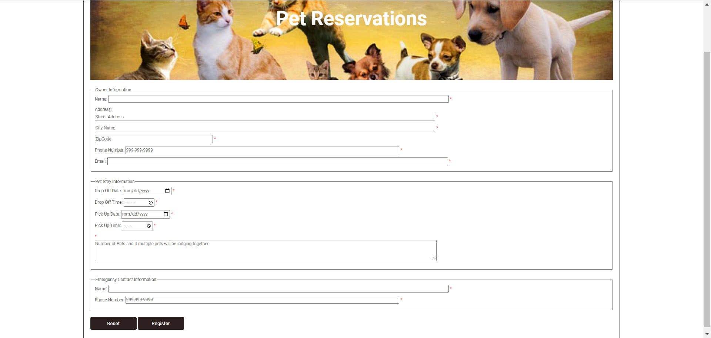
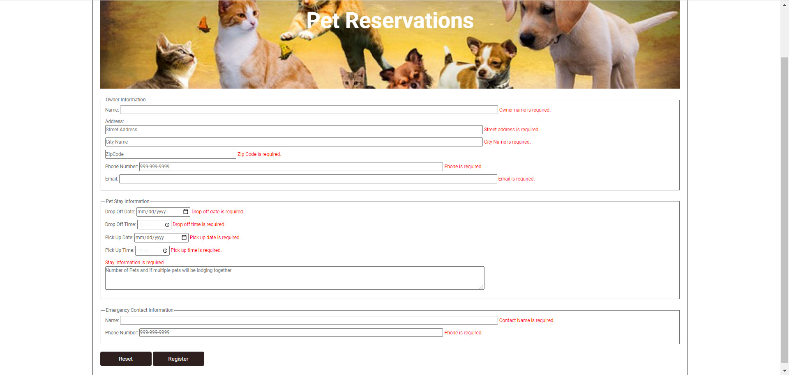
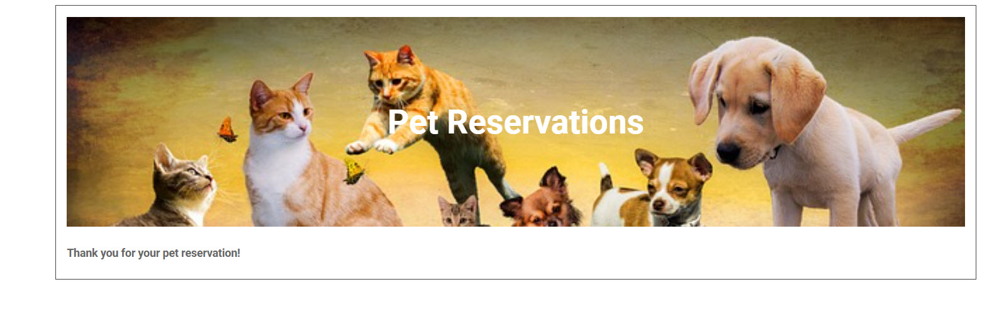

# W09A01 Pet Registration (Forms and Data Validation)

___

For this assignment, you will get an opportunity to add validations to an existing application.  Starting HTML, CSS and Javascript files have been provided.  The HTML and Javascript files will need to be updated.  The goal of this assignment is to complete the application adding data validation for each field on the form.

### Project Overview

___

 When the Pet Reservation application is rendered, it should resemble the following screen shot:

When the form is submitted, all fields should show meaningful messages as indicated in the following screen shot:

When the form is successfully validated, it will display the register.html page as shown below:

 See Eagle for a video walkthrough of the application.

 For this assignment, you must:

1. Add placeholders for the following (Review preceding screenshots):

| Field Type          | Place Holder                      |
| ------------------  | --------------------------------- |
| Address fields      | Description for the field         |
| Phone fields        | Should have 999-999-9999          |
| Stay Information    | Description of what to enter      |

2. When the form is initially rendered the field focus should be on the Owner's Name field.

3. Provide validations for the following when the Register button is pressed.  As part part of the validation processing all leading and trailing spaces should be removed from the entered values and updated within the applicable text boxes and text areas.  Relevant error messages should be displayed in the span fields next to the fields in question. The comments has a span before so you will need to watch how you update this and seriously think about the use of a "next()" to update the span.  If validation results in any error condition, do not let the default submit page behavior to occur.
    - All fields are required, so each field must be validated to ensure something was entered.
      Note: DO NOT use the **required** HTML5 attribute for determining whether data has been entered.  This should be performed in jQuery code; points for these validation checks will **ONLY** be awarded for the jQuery implementation.  
    - Additionally, the following fields will have some additional validation:
      - Zip Code should be validated to check for a five digit numeric entry.  Refer to Exercise 10-1 video walkthrough to determine the regular expression to use for the numeric validation.
    - Phone numbers, both owner and emergency contact, should be validated using a regular expression.  Refer to the Membership Signup application in the book for the details.
    - Owner email should be validated using a regular expression.  Refer to the Membership Signup application in the book for the details.
    - The Pickup date should be validated to ensure that it is after the drop off date (we aren't going to get into worrying about times on this app).

1. The Reset button is clicked and all fields and span values are reset to their initial state.

2. When valid information is entered the register.html page is displayed.
3. Review Grading Criteria to provide more insight on the requested validations.

### Grading Criteria
|Criteria| Total Points Assignment |
|--|--|
| Form updated to do an HTTP Get to the Register.html file.| 2
| Street Address Placeholder Added.| 1
| City Name Placeholder Added.| 1
| Zip Code Placeholder Added.| 1
| Owner Phone Number Placeholder Added with correct format.| 2
| Placeholder added for the Stay Information that includes what should be entered.| 1
| Emergency Contact Phone Number Placeholder Added with correct format.| 2
| The Register button (submit button) successfully fires the validations, i.e., it is correctly wired to execute the function and when a validation error is encountered, the page prevents the default page processing to occur. When there are no validation errors, then the page advances to the register.html page.| 4
| The Reset button (reset button) successfully fires the function to reset the form fields and all fields are cleared and all spans that are used to display messages are cleared and cursor positioning is set to the owner's name field.| 10
| Initially focus for the form is on the Owner's name. This can be done in Javascript or using the new autofocus attribute in html.| 1
| All data entered in any form field is trimmed to eliminate leading or trailing spaces and then updated in the associated form control (textbox, textarea, etc).| 7
| The owner's name is required and validated in jQuery code. If not entered a message is added to the associated field's span.| 2
| The owner's street address is required and validated in jQuery code. If not entered a message is added to the associated field's span.| 2
| The owner's city is required and validated in jQuery code. If not entered a message is added to the associated field's span.| 2
| The zip code is required and validated in jQuery code. If not entered a message is added to the associated field's span. The zip code should also be validated to determine if it is a five digit number that was entered using a regular expression returning a relevant error message if the pattern match fails.| 5
| The owner's phone is required and validated in jQuery code. If not entered a message is added to the associated field's span. The phone should also be validated using a regular expression to determine if the entered phone number is in the correct format. If the pattern match fails for the phone number check then a relevant message should be returned.| 5
| The owner's email is required and validated in jQuery code. If not entered a message is added to the associated field's span. The email should also be validated using a regular expression to determine if the entered email is in the correct format. If the pattern match fails for the email address check then a relevant message should be returned.| 5
| The drop off date is required and validated in jQuery code. If not entered a message is added to the associated field's span.| 2
| The drop off time is required and validated in jQuery code. If not entered a message is added to the associated field's span.| 2
| The pick up date is required and validated in jQuery code. If not entered a message is added to the associated field's span. Additionally, the pick up date should be validated to ensure that the entry is greater than the drop off date. (Hint: use the Date constructor and the getTime() function).| 6
| The pick up time is required and validated in jQuery code. If not entered a message is added to the associated field's span.| 2
| The stay information (comments) is required and validated in jQuery code. If not entered a message is added to the associated field's span.| 2
| The emergency contact's name is required and validated in jQuery code. If not entered a message is added to the associated field's span.| 2
| The emergency contact's phone is required and validated in jQuery code. If not entered a message is added to the associated field's span. The phone should also be validated using a regular expression to determine if the entered phone number is in the correct format. If the pattern match fails for the phone number check then a relevant message should be returned.| 6

### Commit Changes to Remote GitHub Repository

___

1. Post your lab work to the remote GitHub repository. 
